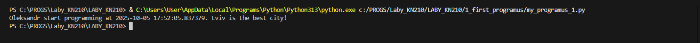
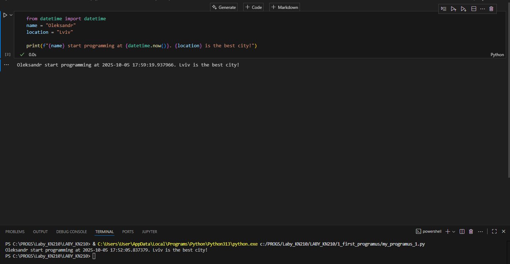
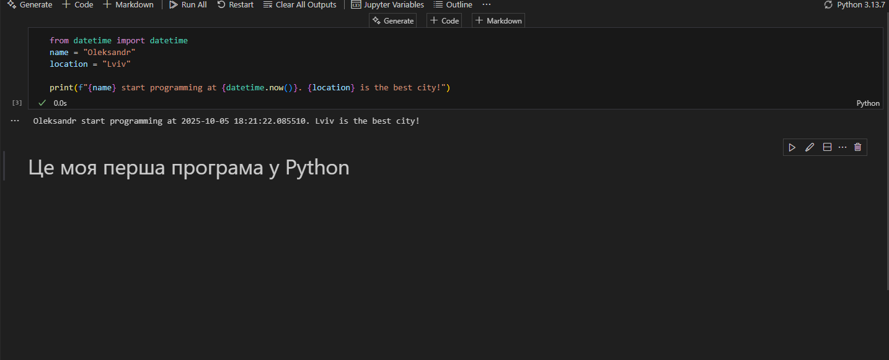

# 🧾 Звіт до роботи

---

## 📘 Тема:
**Вступні заняття: налаштування середовища, прочаток роботи з Python та Markdown**

## 🎯 Мета роботи:
**Налаштувати середовище роботи VS Code, створити репозиторій Github та налаштувати інтеграцію з ним, написати першу програму на Python та створити звіт з використанням форматування Markdown**

---

## ⚙️ Виконання роботи

### 🔹 Результати виконання завдання :

**Розробили / Створили файл: з роширенням Python** 
**Програма вивела значення: Lviv is the best city!**  
**Навчився налаштовувати середовище роботи VS Code, створив репозиторій Github та налаштував інтеграцію з ним, написав першу програму на Python та створив звіт з використанням форматування Markdown**

---

## 🖼️ Фото від 1-4 завдання:



## Фото для 5-7 завдання:


## Фото для 8-9 завдання:


---

## 💾 Вставлений код / текстовий або числовий результат / інші результати

> Так можна вставляти код, або просто вставляти посилання на файл з програмою.

```python
def simple_function_example():
    pass
