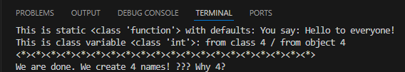
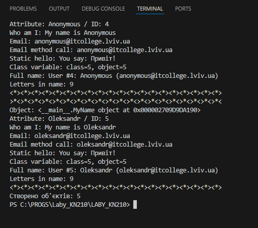

# 🧾 Звіт до роботи

---

## 📘 Тема:
Робота з Класами та Обєктами

## 🎯 Мета роботи:
Навчитись використовувати основні принципи ООП, розглянути кострукції побудови класу та створення обєктів та навчитись працювати з ними

---

## ⚙️ Виконання роботи

### 🔹 Результати виконання завдання 1...N:

**Розробили / Створили код python а також модифікували його під себе** 
 
**Навчились використовувати основні принципи ООП, розглянути конструкції побудови класу та створення об'єктів та навчився працювати з ними**

---

## 🖼️ Вставлені рисунки

## Завдання 1 (фото)

## Фото завдання від 4 до 5

## Відповіді на запитання 
 
# Чому коли передаємо None — створюється Anonymous?
Бо в __init__ стоїть: name = name if name is not None else self.anonymous_user().name

Тобто якщо name == None → використовуємо імʼя Anonymous.

# Як змінити текст привітання
Метод:

me.say_hello("Новий текст!")

# Допишіть функцію в класі яка порахує кількість букв імені

def name_length(self):
    return len(self.name)

# Порахуйте кількість імен у списку names та порівняйте із виведеним результатом. Дайте відповідь чому маємо різну кількість імен?
Додається метод:

def name_length(self):
    return len(self.name)

